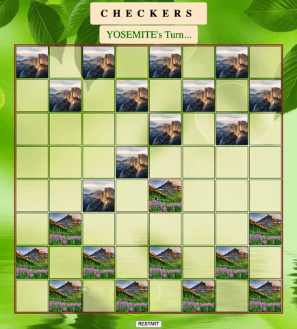

# CHECKERS

## BEHIND THE GAME


     

This version of checkers is a browser ready game that allows two players to play against eachother at the same computer. A winner is determined when all of the pieces of one player have been captured, and the game can be restarted if a stalemate has been reached. 

The game is written using HTML, CSS and JavaScript. 

An initialization function called immediately once the page loads is responsible for rendering the board contents and the message displaying whose turn it is. 

The HTML contains 64 "div" elements, each with their own ID but otherwise contain no information about the presence of a player piece. 

``` HTML
    <body>
        ....
        <section id='board'>
            
            <div id="r0c0"></div>
            <div id="r0c1"></div>
            <div id="r0c2"></div>
            <div id="r0c3"></div>
            <div id="r0c4"></div>
            <div id="r0c5"></div>
            <div id="r0c6"></div>
            <div id="r0c7"></div>
            
            ....
        </section>
    </body>
```

A glabal two-dimensional array is responsible for rendering the game pieces and their location on the board, which is linked to the "div" elements based on their id. 

``` JS
    function init () {
    // numbers at array indexes represent no player present (0) or player present (1 / -1)
        board = [
            [1, 0, 1, 0, 1, 0, 1, 0],
            [0, 1, 0, 1, 0, 1, 0, 1],
            [1, 0, 1, 0, 1, 0, 1, 0],
            [0, 0, 0, 0, 0, 0, 0, 0],
            [0, 0, 0, 0, 0, 0, 0, 0],
            [0, -1, 0, -1, 0, -1, 0, -1],
            [-1, 0, -1, 0, -1, 0, -1, 0],
            [0, -1, 0, -1, 0, -1, 0, -1],
        ];
        ....
    }
```

## GAMEPLAY

[LIVE DEMO](https://ahess96.github.io/checkersGameGA/)

Gameplay is kept simple and accessible to most audiences. A message at the top of the board displays whose turn it is and each player gets one move per turn, at which point the turn ends and the message renders that it is the other player's turn.

Turn, location in the array, movement and winner logic all rely on the presence of the numbers 1 and -1 in the board array. 

There are two event listeners in the JavaScript. One is responsible for restarting the game. The other is responsible for responding to selecting a peice and moving it.



## HIGHLIGHTS

The checkers game is fully functional without bugs or error messages in the console. The styling is designed such that the user enjoys some aspects of the outdoors while playing.

This game required a lot of logic but was kept to a relatively minimal amount of code written in a semantic way and is in large part able to be edited for future modifications or features. 

## CHALLENGES

While the two dimensional board array seems like a great, straightfoward way to track pieces, it has its complications. One of the challenges is being able to consistently access a location on the array and linking it to the div tag that it corresponds to. But this conceptual challenge has the perk of being clear and dynamic during gameplay. 

The function below gives an example of how the id of any given div corresponds to the location in the array when the array is looked at as a gameboard itself. The whole JavaScript is based on grabbing a div by its id and then setting conditionals to determine its assignment.

``` JS
function renderBoard () {
    // render the board such that the values held in the board array are reflected by the color of the player's pieces
    // this iterates through each array in board
    board.forEach(function(rowArr, rowIdx) {
        // now iterate through each index within the nested arrays which represent row
        rowArr.forEach(function(cellVal, colIdx) {
            const cellId = `r${rowIdx}c${colIdx}`;
            const cellEl = document.getElementById(cellId);
            if(cellVal === 2 && isPieceActive === false) {
                board[rowIdx][colIdx] = 0;
            }
            cellEl.style.background = icons[board[rowIdx][colIdx]];
```

## FUTURE ENHANCEMENTS

Future updates to this game may include options for different themes, a functional king piece and embedded sounds. The themes will entail changes to the appearence of the pieces as well as to the overall board, and selection of these themes would be accessible on the same page as gameplay. A king piece will be able to move in all directions and take on a new appearence as well, while sounds will reinforce clicks, movements, and the winner.


